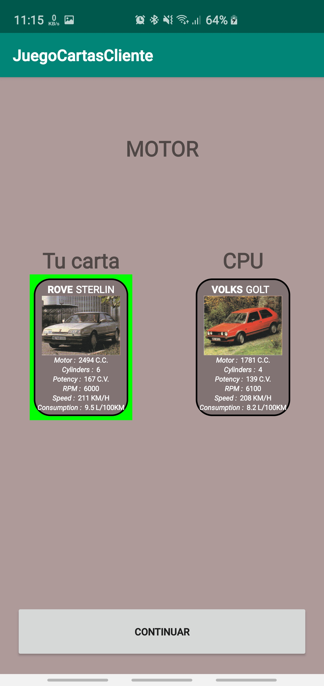

# Reglas del juego
Esta aplicación es un juego de cartas en el cual un **jugador** jugará contra la **CPU**. 

Consta de **6 cartas para el jugador** y **6 cartas para la CPU**. **Las cartas no están repetidas ni pueden los dos tener una misma**.

Se sortea quien empieza sacando. **Si empieza el jugador seleccionará una carta y una característica**, y si **empieza la CPU el jugador solo seleccionará una carta**.

Al final de cada mano se mostrará quien ha ganado o si ha habido un empate.

Al finalizar las 6 manos se mostrará el ganador o si ha habido un empate.

Todos los resultados de las manos y de las partidas jugadas se guardará en una base de datos para posteriormente poder sacar estadísticas como un ranking de jugadores y el winrate de las cartas.

# Pantalla de inicio de sesión

La primera pantalla de todas es la de inicio se sesión. En esta iniciaremos sesión en el servidor para poder empezar a jugar.

Escribimos el **usuario** y la **contraseña**, y si deseamos que la aplicación las recuerde para no tener que volver a escribirlas, **marcamos el CheckBox**. *Tranquilo, las contraseñas estan encriptadas con sha1.*

Si no disponemos de un usuario, nos podemos crear uno pinchando en el mensaje de **registro**. 

# Pantalla de registro

En esta pantalla escribiremos nuestro **usuario**, **contraseña**, **nombre** y **apellidos** y se registrará en la aplicación. Si el usuario ya existe, aparecerá un **mensaje de error**.

# Pantalla principal

En esta pantalla disponemos de un ranking con los **5 mejores jugadores** ordenados por número de victorias.

También disponemos en la parte superior derecha un boton de menú que nos abre las **preferencias** de la aplicación.

La última función de esta pantalla es la de **crear un nuevo juego**. 

# Pantalla preferencias

Aquí podremos **desmarcar la opción de recordar el usuario y la contraseña** y la próxima vez que iniciemos sesión nos volverá a pedir estos datos.

Si queremos **cerrar la sesión**, solo tendremos que pulsar sobre cerrar sesión.

***NEW***

Para cambiar la inteligencia del bot tenemos que pulsar sobre **dificultad del bot** y seleccionar la que nos interese.

# Pantalla selección de carta

Al empezar el juego, la aplicación nos mostrará esta pantalla que tiene las **cartas que nos han tocado**.

Si nos ha tocado sacar a nosotros, deberemos seleccionar una carta de la lista, se pondrá en la carta grande, a continuación la pulsamos para que nos muestre un **dialogo** para seleccionar la **característica** que queremos jugar.

Si ha empezado la CPU, nos aparecerá directamente la caracteristica que ha elegido y solo tendremos que pulsar sobre la **carta** que queremos jugar de la lista.

## Dialogo selección de característica

Después de haber seleccionado la característica pulamos sobre **enviar**. El servidor seleccionara la carta de la CPU y nos mostrará el **resultado de la mano**.

# Pantalla del resultado de la mano

Nos mostrará la característica que estaba jugando y las dos cartas. Marcará en **verde la que ha ganado** o las marcará a **las dos si es un empate**.

Para continuar en el juego pulsamos sobre el botón de **continuar**.

# Pantalla del resultado de la partida

Cuando se hayan jugado todas las rondas, nos mostrará el **resultado de la partida**. En **verde si has ganado**, **en rojo si has perdido** o **sin ningún color si has empatado**.

Para salir a la pantalla principal pulsamos sobre el botón **continuar**. Nos aparecerá el **ranking actualizado**.

